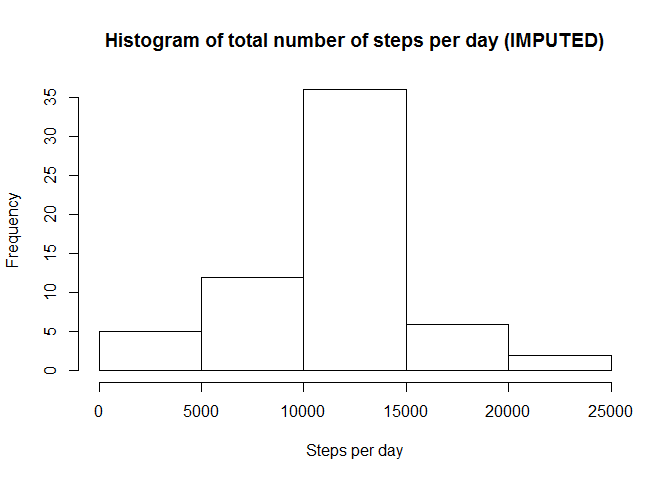

Load the data file into a data frame

```r
activity <- read.csv("activity.csv", as.is = TRUE)
```

Remove the NA values and store in a separate structure for future use

```r
good_act <- activity[complete.cases(activity), ]
```

Calculate the total number of steps taken per day

```r
steps_per_day <- aggregate(steps ~ date, good_act, sum)
```

Create a histogram of no of steps per day

```r
hist(steps_per_day$steps, main = "Histogram of total number of steps per day", xlab = "Steps per day")
```

<!-- -->

Calculate the mean and median of the total number of steps taken per day

```r
round(mean(steps_per_day$steps))
```

```
## [1] 10766
```


```r
median(steps_per_day$steps)
```

```
## [1] 10765
```

Calculate average steps per interval for all days 

```r
avg_steps_per_interval <- aggregate(steps ~ interval, good_act, mean)
```

Calculate average steps per day for all intervals 

```r
avg_steps_per_day <- aggregate(steps ~ date, good_act, mean)
```

Plot the time series with appropriate labels and heading

```r
plot(avg_steps_per_interval$interval, avg_steps_per_interval$steps, type='l', col=1, main="Average number of steps by Interval", xlab="Time Intervals", ylab="Average number of steps")
```

<!-- -->

Identify the interval index which has the highest average steps

```r
interval_idx <- which.max(avg_steps_per_interval$steps)
```

Identify the specific interval and the average steps for that interval

```r
print (paste("The interval with the highest avg steps is ", avg_steps_per_interval[interval_idx, ]$interval, " and the no of steps for that interval is ", round(avg_steps_per_interval[interval_idx, ]$steps, digits = 1)))
```

```
## [1] "The interval with the highest avg steps is  835  and the no of steps for that interval is  206.2"
```

Calculate the number of rows with missing values

```r
missing_value_act <- activity[!complete.cases(activity), ]
nrow(missing_value_act)
```

```
## [1] 2304
```

Loop thru all the rows of activity, find the one with NA for steps.
For each identify the interval for that row
Then identify the avg steps for that interval in avg_steps_per_interval
Substitute the NA value with that value

```r
for (i in 1:nrow(activity)) {
    if(is.na(activity$steps[i])) {
        val <- avg_steps_per_interval$steps[which(avg_steps_per_interval$interval == activity$interval[i])]
        activity$steps[i] <- val 
    }
}
```

Aggregate the steps per day with the imputed values

```r
steps_per_day_impute <- aggregate(steps ~ date, activity, sum)
```

Draw a histogram of the value 

```r
hist(steps_per_day_impute$steps, main = "Histogram of total number of steps per day (IMPUTED)", xlab = "Steps per day")
```

<!-- -->

Compute the mean and median of the imputed value
Calculate the mean and median of the total number of steps taken per day

```r
round(mean(steps_per_day_impute$steps))
```

```
## [1] 10766
```

```r
median(steps_per_day_impute$steps)
```

```
## [1] 10766.19
```

Cretae a function to determine if the date is a weekday

```r
week_day <- function(date_val) {
    wd <- weekdays(as.Date(date_val, '%Y-%m-%d'))
    if  (!(wd == 'Saturday' || wd == 'Sunday')) {
        x <- 'Weekday'
    } else {
        x <- 'Weekend'
    }
    x
}
```

Apply the week_day function and add a new column to activity dataset

```r
activity$day_type <- as.factor(sapply(activity$date, week_day))
```

load the ggplot library

```r
library(ggplot2)
```

Create the aggregated data frame by intervals and day_type

```r
steps_per_day_impute <- aggregate(steps ~ interval+day_type, activity, mean)
```

Create the plot

```r
plt <- ggplot(steps_per_day_impute, aes(interval, steps)) +
    geom_line(stat = "identity", aes(colour = day_type)) +
    theme_gray() +
    facet_grid(day_type ~ ., scales="fixed", space="fixed") +
    labs(x="Interval", y=expression("No of Steps")) +
    ggtitle("No of steps Per Interval by day type")
print(plt)
```

<!-- -->
